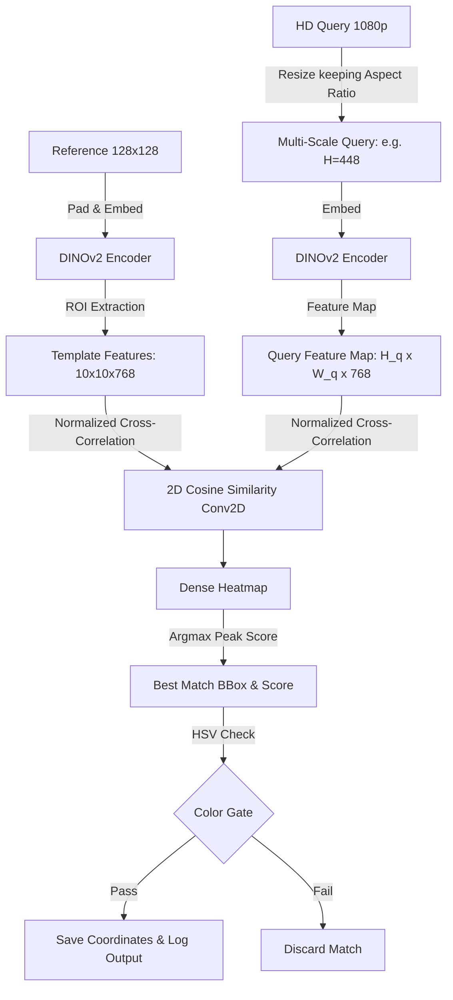

# Feature Detection Project Guide

This project implements a dense feature detection and localization pipeline using **DINOv2** (`facebook/dinov2-base`). It is designed to find a small reference template image within a sequence of query images and output the matched image names along with their 3D spatial coordinates.

---

## 📂 Project Structure

- **[detection_prat.py](file:///home/prath/Downloads/feature_detection/detection_prat.py)**: The main, improved detection pipeline. It uses multi-scale dense similarity mapping to match lower-resolution reference templates against high-resolution webcam/HD query images.
- **[detection.py](file:///home/prath/Downloads/feature_detection/detection.py)**: The baseline detection pipeline. It resizes both the reference and query frames to 128×128, leading to aspect ratio squashing and localization accuracy loss on HD inputs.
- **[ref_images/](file:///home/prath/Downloads/feature_detection/ref_images)**: Directory containing reference image templates (e.g., photos from a phone).
- **[images_dir/](file:///home/prath/Downloads/feature_detection/images_dir)**: Directory containing high-resolution query frames (`image_*.jpg`) and their corresponding metadata YAML files (`image_*.yaml`) containing ground truth 3D spatial positions.
- **[matched_coordinates.yml](file:///home/prath/Downloads/feature_detection/matched_coordinates.yml)**: Output file containing a list of the 3D coordinates of all query frames where a valid match was detected.

---

## ⚙️ Pipelines Comparison

### 1. Baseline Pipeline (`detection.py`)
The baseline pipeline operates by downsampling all inputs to 128×128 pixels:
- **Resizing**: Resizes both the reference and query images to $128 \times 128$ (squashing any non-1:1 aspect ratio inputs).
- **Embedding**: Computes DINOv2 embeddings on the $128 \times 128$ canvas padded to $224 \times 224$ (via [_pad_to_224](file:///home/prath/Downloads/feature_detection/detection.py#L36-L45)), producing a spatial representation of $10 \times 10$ patches ($100$ tokens of $768$ dimensions).
- **Matching**: Computes cosine similarity between all reference patches and all query patches ([compare_and_localize](file:///home/prath/Downloads/feature_detection/detection.py#L134-L198)).
- **Localization**: Uses thresholding and connected components on the $10 \times 10$ similarity grid to identify the target region and upscales the coordinate back to the original image size.

> [!WARNING]
> **Limitations**: Since HD query images (e.g., 1080p webcams) are severely downsampled to $128 \times 128$, fine details are lost, and aspect ratios are distorted. A single $14 \times 14$ DINOv2 patch represents a huge region of the original HD frame, making precise localization impossible.

---

### 2. Improved Pipeline (`detection_prat.py`)
To match a small, possibly lower-resolution reference patch (e.g., $128 \times 128$ from a phone) inside a high-resolution query image without loss of detail, `detection_prat.py` implements **Dense Deep Feature Template Matching**:



- **Reference Embedding**: The reference is forced to $128 \times 128$, padded to $224 \times 224$ (via [_pad_to_224](file:///home/prath/Downloads/feature_detection/detection_prat.py#L36-L45)), and encoded. Its central $10 \times 10$ region is extracted to form a spatial template filter of shape `[10, 10, 768]`.
- **Query Processing**: The query image is processed at multiple heights (`[336, 448, 560]`) while **preserving its aspect ratio** ([compare_and_localize](file:///home/prath/Downloads/feature_detection/detection_prat.py#L199-L264)). The width is dynamically rounded to the nearest multiple of 14 (DINOv2 patch size).
- **Dense Cross-Correlation**: We treat the reference template as a 2D convolutional filter and apply it over the query feature map using `torch.nn.functional.conv2d` ([compute_dense_similarity](file:///home/prath/Downloads/feature_detection/detection_prat.py#L83-L108)). This produces a dense spatial similarity heatmap.
- **HSV Color Gating**: Once a candidate match is located, the cropped region is resized to $128 \times 128$ and compared with the reference template's Hue and Saturation mean/std-dev bounds to prevent false positive matches ([check_color_gate](file:///home/prath/Downloads/feature_detection/detection_prat.py#L179-L194)).

---

## 🚀 Execution & Usage

### Running the Improved Pipeline
To run the main detection script, specify the query images folder and reference images folder:
```bash
python detection_prat.py images_dir ref_images/
```

### Hyperparameters
You can adjust the following parameters inside the script:
- `MATCH_THRESHOLD` (default: `0.70`): The minimum cosine similarity score required to declare a match.
- `H_GATE_SIGMA` & `S_GATE_SIGMA` (default: `2.0`): The multiplier of standard deviations allowed for Hue and Saturation validation.
- `SHOW_DEBUG` (default: `True`): Toggles whether to open an OpenCV window displaying the bounding box and centroid of detected matches.

### Output
1. **Terminal logs**: Only the filename and confidence percentage are output to standard output:
   ```text
   image_45.jpg 78.43%
   ```
2. **Coordinate File**: The 3D coordinates from the matched frames' YAML files are saved in `matched_coordinates.yml`:
   ```yaml
   - x: 0.0063567087054252625
     y: -0.0405464842915535
     z: 1.8247483968734741
   ```
